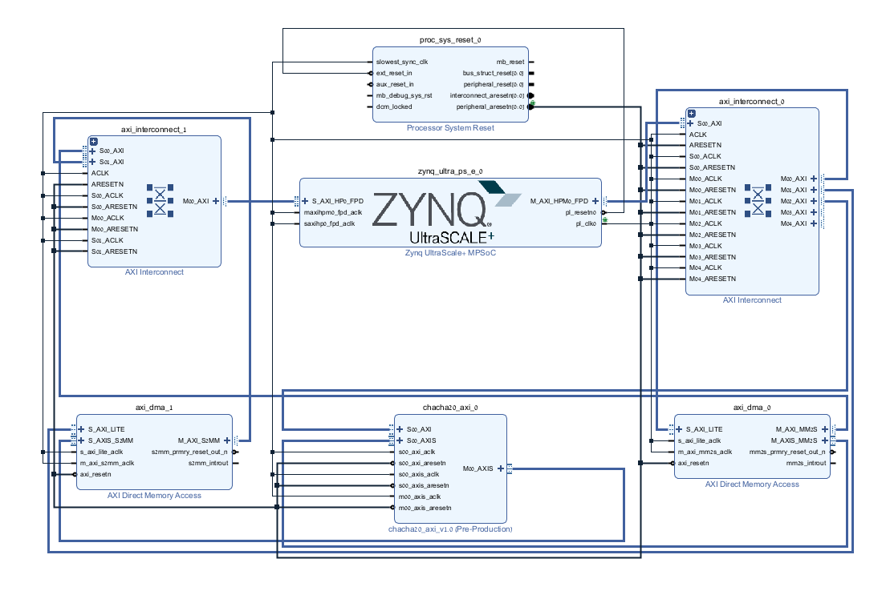

# ChaCha20 Hardware Accelerator on Zynq SoC

## Overview
This project showcases a custom-designed **ChaCha20 cryptographic hardware accelerator**, implemented on a Xilinx Zynq UltraScale+ SoC. The primary objective was to develop a robust encryption system capable of processing large data streams with high security and minimal latency, leveraging dedicated FPGA logic to outperform software-based implementations.

## System Architecture & SoC Integration
The design integrates multiple hardware components to ensure reliable data movement and processing:
* **Custom ChaCha20 IP (PL):** A high-speed Verilog core implementing the stream cipher.
* **AXI DMA Controller:** Acts as the high-speed data mover. It utilizes **AXI4-Memory Map (AXI-MM)** to fetch data from memory and **AXI4-Stream** to push it into the crypto core.
* **Infrastructure Blocks:** Includes **AXI Interconnects** for bus arbitration and data flow management, and Processor System Reset modules to ensure synchronized hardware startup.
* **Processing System (PS):** An ARM-based processor running **Embedded Linux**, responsible for system orchestration and hardware validation.

## Technical Specifications & Standards
* **Protocol Standard (RFC 7539):** The core logic is strictly compliant with the IETF RFC 7539 standard. This ensures that the hardware accelerator is 100% compatible with global software standards (like OpenSSL).
* **Data Capacity:** Optimized for 512-bit block processing (64 bytes) per iteration, suitable for high-bandwidth streams.
* **Memory Alignment:** The DMA engine requires 32-bit aligned memory addresses for stable burst transfers.
* **Hardware Addressing:**
  * **DMA TX:** `0xA0000000`
  * **DMA RX:** `0xA0010000`
  * **ChaCha20 IP Control:** `0xA0020000`

## AXI4 Interfaces
* **AXI4-Lite (Control Path):** Used by the CPU to safely configure the hardware, setting the 256-bit Key, 96-bit Nonce, and 32-bit initial counter into the IP's registers.
* **AXI4-Stream (Datapath):** A zero-latency interface connecting the DMA directly to the ChaCha20 IP for continuous, high-speed data flow.
* **AXI4-MM (Memory Map):** Used by the DMA to interface directly with the SoC's DDR memory.

## Hardware Implementation (Verilog)
At the heart of this project is the custom Verilog RTL implementing the ChaCha20 algorithm:
* **FSM-Based Control:** A Finite State Machine strictly manages the initialization phase and the 20-round cryptographic computations.
* **Hardware Parallelism:** Utilizing the ARX (Add-Rotate-XOR) architecture, mathematical operations are physically wired for parallel execution.
* **Real-time Processing:** The keystream undergoes a **real-time** bitwise XOR operation with the incoming AXI-Stream plaintext, outputting ciphertext immediately with minimal latency.

## Verification & On-Board Validation
The system was validated on a physical Zynq SoC using a C-based validation script. The process demonstrates a full cryptographic cycle:

### 1. Encryption Phase:
* **Input Plaintext:** `"ChaCha20 hardware accelerator running at full 512-bit capacity!"`
* **Keystream Generation:** The hardware engine generates a unique 512-bit keystream based on the provided 256-bit Key and Nonce.
* **Real-time XOR:** The IP performs a bitwise XOR between the plaintext and the keystream.
* **Ciphertext (Output):** The resulting encrypted stream is captured via DMA. The output is verified as bit-perfect (Example HEX: `D2 4A 7B 1F`).

### 2. Decryption & Recovery (Decipher):
* **Symmetric Property:** Due to the nature of stream ciphers, the generated Ciphertext is fed back into the hardware accelerator.
* **XOR Reversibility:** Applying a second XOR operation with the identical keystream in real-time perfectly recovers the original message.
* **Result:** The final output is verified to be identical to the original input string, proving the arithmetic and timing integrity of the FPGA implementation.

### 3. Methodology:
* **Static Test Vectors:** Used fixed 256-bit Keys and 64-byte payloads for deterministic verification against reference standards.
* **Shadow Buffering (udmabuf):** Implementation of `udmabuf` (userspace DMA buffers) ensures safe and synchronized memory sharing between Linux and the FPGA hardware.

## Project Structure
* [RTL](./RTL) - Custom Verilog source files for the ChaCha20 IP (English comments).
* [Vivado](./block_design.png) - Block design and system architecture.
* [Hardware_Validation](./Hardware_Validation) - C scripts used for hardware validation and on-board debugging.

---
*A hardware-focused portfolio project demonstrating FPGA design, custom IP creation, and AXI architecture.*
