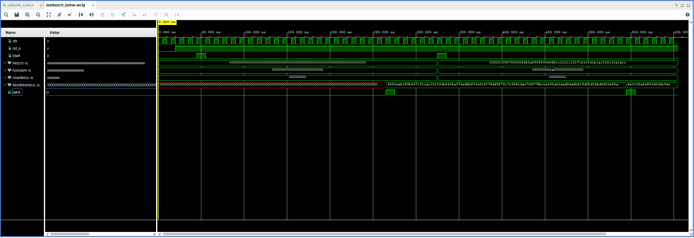

# ChaCha20 Hardware Accelerator on Zynq SoC

## Overview
This project showcases a custom-designed **ChaCha20 cryptographic hardware accelerator**, implemented on a Xilinx Zynq UltraScale+ SoC. Today, ChaCha20 is widely used to secure everyday internet communication and VPNs. The primary objective was to develop a robust encryption system capable of processing large data streams with high security and minimal latency, leveraging dedicated FPGA logic to outperform software-based implementations.

## System Architecture & SoC Integration
The design integrates multiple hardware components to ensure reliable data movement and processing:
* **Custom ChaCha20 IP (PL):** A high-speed Verilog core implementing the stream cipher.
* **AXI DMA Controller:** Acts as the high-speed data mover. It utilizes **AXI4-Memory Map (AXI-MM)** to fetch data from memory and **AXI4-Stream** to push it into the crypto core.
* **Infrastructure Blocks:** Includes **AXI Interconnects** for bus arbitration and data flow management, and Processor System Reset modules to ensure synchronized hardware startup.
* **Processing System (PS):** An ARM-based processor running **Embedded Linux**, responsible for system orchestration and hardware validation.

## Technical Specifications & Standards
* **Protocol Standard (RFC 7539):** The core logic is strictly compliant with the IETF RFC 7539 standard. This ensures that the hardware accelerator is 100% compatible with global software standards (like OpenSSL).
* **Data Capacity:** Optimized for 512-bit block processing (64 bytes) per iteration, suitable for high-bandwidth streams.
* **Memory Alignment:** The DMA engine requires 32-bit aligned memory addresses for stable burst transfers.
* **Hardware Addressing:**
  * **DMA TX:** `0xA0000000`
  * **DMA RX:** `0xA0010000`
  * **ChaCha20 IP Control:** `0xA0020000`

## AXI4 Interfaces
* **AXI4-Lite (Control Path):** Used by the CPU to safely configure the hardware, setting the 256-bit Key, 96-bit Nonce, and 32-bit initial counter into the IP's registers.
* **AXI4-Stream (Datapath):** A zero-latency interface connecting the DMA directly to the ChaCha20 IP for continuous, high-speed data flow.
* **AXI4-MM (Memory Map):** Used by the DMA to interface directly with the SoC's DDR memory.

## Hardware Implementation (Verilog)
At the heart of this project is the custom Verilog RTL implementing the ChaCha20 algorithm. The design revolves around two core engineering concepts: the Cryptographic State Matrix and the hardware FSM.

### 1. The State Matrix & Algorithmic Uniqueness
ChaCha20 is a pure stream cipher that derives its cryptographic strength entirely from **ARX** (Addition, Rotation, XOR) operations. By relying strictly on these straightforward mathematical and bitwise functions rather than complex memory lookups, the algorithm is exceptionally fast, highly secure, and highly efficient to implement in silicon. 
The hardware initializes a 512-bit state matrix (a 4x4 grid of 32-bit words) exactly per the RFC standard:
* **Constants (128-bit):** 4 fixed words that prevent zero-state vulnerabilities.
* **Key (256-bit):** The primary secret symmetric key.
* **Block Counter (32-bit):** Increments for each new 64-byte block, allowing random access and preventing keystream repetition across large data streams.
* **Nonce (96-bit):** A "Number Used Once" to ensure unique ciphertexts even if the same key is reused for different messages.

**The Encryption Flow:** Once initialized, the algorithm scrambles this matrix through 20 rounds of intense ARX mixing. The original state is then mathematically added to the scrambled result to produce a 512-bit keystream. Finally, this keystream is XORed with the incoming plaintext to generate the ciphertext. Because this is a symmetric stream cipher, the exact same mathematical flow is used for decryption: feeding the shared secret Key and public Nonce into the receiver's hardware generates the identical keystream, perfectly restoring the original plaintext.

### 2. RTL Architecture & FSM
* **FSM-Based Control:** A 5-state Finite State Machine strictly manages the execution pipeline:
  * `IDLE`: Awaiting the start signal.
  * `INIT`: Loading the 512-bit initial matrix.
  * `ROUNDS`: Executing the 20-round core engine. This phase alternates between **Column Rounds** (mixing data vertically) and **Diagonal Rounds** (mixing data diagonally) to guarantee rapid cryptographic diffusion across the entire matrix.
  * `FINAL_ADD`: Adding the original state to the scrambled state to ensure non-reversibility.
  * `DONE`: Triggering the `valid` flag for the AXI-Stream interface.
* **Hardware Parallelism:** By physically wiring the ARX operations, multiple matrix cells are processed simultaneously per clock cycle, drastically reducing latency compared to sequential software execution.
* **Real-time Processing:** The generated 512-bit keystream undergoes a **real-time** bitwise XOR operation with the incoming AXI-Stream plaintext, outputting ciphertext immediately.

## Pre-Hardware Verification (Simulation)
Prior to hardware implementation, the design was verified using a custom **Verilog Testbench** in Vivado Simulator to ensure full compliance with cryptographic standards.

### 1. Testbench Methodology
The testbench uses modular **Tasks** to run multiple test cases, including the official **RFC 7539 Standard Test Vector**. This automated process compares the hardware-generated keystream against the expected mathematical results defined by the IETF.

### 2. Waveform Analysis & Timing
The captured simulation waveform visually demonstrates the hardware's cycle-accurate behavior during an encryption task:
* **Initialization & Computation Gap:** A single-clock pulse on the `start` signal triggers the FSM. The time gap between this `start` pulse and the `valid` signal rising represents the exact clock-cycle latency required for the 20-round ARX pipeline to process the matrix.
* **Standard Compliance (Visualized):** Precisely when the `valid` flag transitions to high (`1`), the 512-bit `keystream` bus updates with the final computed data. The waveform shows the first 32-bit word emerging as `e4e7f110...`, which is a bit-perfect match to the IETF RFC 7539 reference vector.
* **AXI-Stream Synchronization:** This `valid` signal acts as the trigger for the AXI-Stream `TVALID` line, guaranteeing that the DMA engine only pulls mathematically verified ciphertext.

## Verification & On-Board Validation
The system was validated on a physical Zynq SoC using a C-based validation script. The process demonstrates a full cryptographic cycle:

### 1. Encryption Phase:
* **Input Plaintext:** `"ChaCha20 hardware accelerator running at full 512-bit capacity!"`
* **Keystream Generation:** The hardware engine generates a unique 512-bit keystream based on the provided 256-bit Key and Nonce.
* **Real-time XOR:** The IP performs a bitwise XOR between the plaintext and the keystream.
* **Ciphertext (Output):** The resulting encrypted stream is captured via DMA (Example HEX: 5A 3B DC EB ...). The hardware seamlessly decrypts this exact stream back to the original plaintext, verifying on-board functional correctness.

### 2. Decryption & Recovery (Decipher):
* **Symmetric Property:** Due to the nature of stream ciphers, the generated Ciphertext is fed back into the hardware accelerator.
* **XOR Reversibility:** Applying a second XOR operation with the identical keystream in real-time perfectly recovers the original message.
* **Result:** The final output is verified to be identical to the original input string, proving the arithmetic and timing integrity of the FPGA implementation.

### 3. Methodology & System Drivers:
* **Static Test Vectors:** Used fixed 256-bit Keys and 64-byte payloads for deterministic verification against reference standards.
* **Kernel-Level Driver (udmabuf):** Leveraged the `udmabuf` (userspace DMA buffers) driver to allocate physically contiguous memory. This ensures a reliable interface for DMA transfers and provides synchronized memory sharing between Linux userspace and the FPGA hardware.

## Project Structure
* [RTL](./RTL) - Custom Verilog source files for the ChaCha20 IP (English comments).
* [Simulation](./Simulation) - Functional Testbench and simulation configurations.
* [Vivado](./block_design.png) - Block design and system architecture.
* [Hardware_Validation](./Hardware_Validation) - C scripts used for hardware validation and on-board debugging.

---
*A hardware-focused portfolio project demonstrating FPGA design, custom IP creation, and AXI architecture.*
